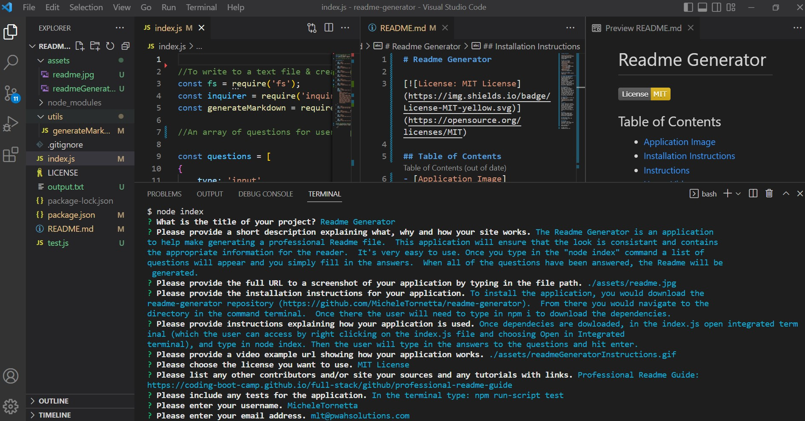

# Readme Generator

## Table of Contents 
- [Application Image](#application-image)
- [Installation Instructions](#installation)
- [Instructions](#instructions--usage)
- [Usage Video](#usage-video)
- [License](#license)
- [Credits](#credits)
- [Application Test](#application-test)
- [Questions](#questions)

## Application Image 

## Installation Instructions
To install the application, you would download the readme-generator repository (https://github.com/MicheleTornetta/readme-generator).  From there you would navigate to the directory in the command terminal.  Once there the user will need to type in npm i to download the dependencies. 

## Instructions
Once dependecies are dowloaded, in the index.js open integrated terminal (which the user can access by right clicking on the index.js file and choosing Open in Integrated terminal), and type in node index. Then the user will type in the answers to the questions and hit enter.

## Usage Video

An example of how it works can be viewed here: 

## License 
A short, permissive software license. Basically, you can do whatever you want as long as you include the original copyright and license notice in any copy of the software/source.  There are many variations of this license in use.

## Credits 
Professional Readme Guide: https://coding-boot-camp.github.io/full-stack/github/professional-readme-guide

## Application Test
In the terminal type: npm run-script test

## Questions
If you would like to contribute or you simply have questions, please visit: 

https://github.com/MicheleTornetta

or email me at:
mlt@pwahsolutions.com
